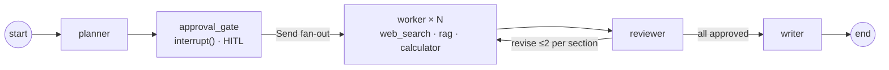

# Atlas — Autonomous Research & Report Agent

Give Atlas a research topic. It plans the report into sections, **pauses for your approval**,
researches every section **in parallel** with real tools, **grades and revises** weak sections
in a self-correcting loop, and synthesizes a cited Markdown report — **streamed to the browser
live**, and **durable enough to survive a server restart mid-run**.

Built on **LangGraph 1.x** (StateGraph · `Send` fan-out · `interrupt()` HITL · Postgres
checkpointer), **FastAPI + SSE**, and a hand-built **React 19 + Tailwind v4** SPA.


---

## Architecture



- **planner** decomposes the topic into 3–6 sections (structured output).
- **approval_gate** calls `interrupt()` and waits for a human approve/edit — persisted by the
  checkpointer, so the pause survives a process restart.
- **worker × N** fan out via the `Send` API, each researching one section with bounded tool use.
- **reviewer** grades every draft; weak sections loop back to a worker with concrete feedback
  (hard-capped at 2 revisions/section, with a no-progress early-stop).
- **writer** merges the best drafts into one report with a deduplicated, numbered source list.

## Why LangGraph

This workflow is a poor fit for a linear chain or a plain DAG, and LangGraph earns its place on
three specific features:

- **Durable interrupts.** `interrupt()` + a checkpointer turn "pause for human approval" into a
  first-class, persisted state. A run can be killed at the approval gate and **resumed by a fresh
  process** from Postgres — the core thesis of the project (see the durability demo below).
- **`Send` fan-out.** The planner produces a variable number of sections; the `Send` API
  dispatches one parallel `worker` per section without hardcoding the width.
- **Cycles.** The reviewer→worker revise loop is a real cycle with a bounded budget — something a
  DAG framework can't express. Conditional edges make termination provable
  (`route_after_review` dispatches each section at most `1 + MAX_REVISIONS_PER_SECTION` times).

## Benchmark results

Numbers are **real** and reproduced from the eval harness (`backend/evals/`). They are a small
**smoke sample (n=4, seed 42)** — directional, not a full benchmark. Reproduce with
`uv run python evals/run_benchmark.py --smoke`.

**Latest run** — `backend/evals/SAMPLE_RESULTS.md` (routed models, strong judge `gpt-4o`):

| Metric | Value |
| --- | --- |
| Task success rate | **25.0%** (1/4 topics clear the 0.8 groundedness bar) |
| Latency p50 / p95 | **60.8s / 121.2s** |
| Mean cost / run | **$0.0883** |
| First-failing grader | **groundedness** on 3/4 failures |

**Model-routing cost study** — `backend/evals/EXPERIMENTS.md` (F9; costs derived by re-pricing a
measured run, so token trajectories are held fixed across tiers):

| Config | Mean cost / run | Basis |
| --- | --- | --- |
| all `gpt-4o` | $0.3995 | projected |
| **routed (default)** — worker→`gpt-4o-mini`, rest→`gpt-4o` | **$0.1250** | projected |
| all `gpt-4o-mini` | $0.0240 | measured |

Routing the high-volume worker to the cheap tier **saves ~68.7% vs all-`gpt-4o`** while keeping
planning/reviewing/writing on the strong model. **Caveat:** the "success stays within 3 points of
all-`gpt-4o`" quality gate has **not** yet been verified live (n=20) — it's an open item, not a
passed check.

### Failure taxonomy → what changed

**Groundedness was the dominant failure (75% of failed runs)** — drafts made claims the retrieved
sources didn't support. Two changes moved the needle:

- **Reviewer grounding rubric** (F4/F7): the reviewer sees each source *with its excerpt* and
  judges whether every cited claim actually follows from it, reserving `revise` for substantive
  gaps (not style).
- **No-progress early-stop** (F4): a section whose revision didn't raise its score stops early
  instead of burning its whole budget on non-converging passes.

Net effect across the four topics: total revision loops **39 → 15 (−62%)**, p50 latency
**146.3s → 60.8s (−58%)**, and groundedness improved on every topic (DNS crossed the passing bar).

## Quickstart

### Option A — Docker (full stack, one command)

```bash
git clone <repo> && cd atlas-research-agents
cp .env.example .env          # then fill OPENAI_API_KEY + TAVILY_API_KEY
docker compose up --build     # postgres → backend → frontend
# → open http://localhost
```

`docker compose up` builds all three services (Postgres, FastAPI backend, nginx-served SPA).
The backend uses the Postgres checkpointer; nginx proxies `/api` (SSE-safe) to the backend.

**Durability demo (the thesis):** start a run, stop at the approval pause, then
`docker compose restart backend`, and approve in the browser — the run resumes from the Postgres
checkpoint to a finished report.

### Option B — Dev mode (hot reload)

```bash
# Postgres only (checkpoints); backend + frontend run on the host
docker compose up -d postgres

# terminal 1 — backend (sqlite checkpointer by default)
cd backend && cp ../.env.example .env   # fill real keys
uv sync && uv run uvicorn app.main:app --port 8000

# terminal 2 — frontend (Vite dev proxy forwards /api → :8000)
cd frontend && npm install && npm run dev
# → http://localhost:5173
```

See [`DEPLOYMENT.md`](DEPLOYMENT.md) for the env matrix, the single-worker constraint, Postgres
backup, CORS, and a worked Fly.io example.

## Repository map

```
atlas-research-agents/
├── docker-compose.yml          # postgres + backend + frontend
├── .env.example                # backend/compose config (dev + Docker)
├── DEPLOYMENT.md               # production notes
├── .github/workflows/          # ci.yml (lint/type/test + docker builds) · evals-smoke.yml (manual)
├── backend/                    # Python 3.12 · uv · FastAPI · LangGraph
│   ├── Dockerfile              # multi-stage uv → slim, non-root, healthcheck
│   ├── app/
│   │   ├── main.py             # FastAPI factory + /api/health
│   │   ├── config.py           # pydantic-settings Settings
│   │   ├── api/                # run lifecycle routes + SSE
│   │   ├── graph/              # state.py (schema) · builder · nodes · routing
│   │   ├── tools/              # web_search · rag · calculator
│   │   ├── llm/router.py       # role→model routing + usage tracking
│   │   ├── persistence/        # checkpointer factory · runs_repo
│   │   └── services/           # run_service (start/resume)
│   └── evals/                  # benchmark harness + reports
└── frontend/                   # React 19 · TS · Vite · Tailwind v4
    ├── Dockerfile              # node build → nginx
    ├── nginx.conf              # SPA + /api proxy (SSE-safe)
    └── src/                    # api client · types · stores · components · pages
```

## Limitations (honest)

- **Single backend worker.** The SSE registry is in-process, so the backend must run one worker
  and can't be horizontally scaled as-is. The real fix (task queue + Redis pub/sub) is described
  in [`DEPLOYMENT.md`](DEPLOYMENT.md); run state is already durable in Postgres.
- **Benchmark is a smoke sample (n=4).** Absolute numbers are noisy; treat them as directional.
- **F9 quality-parity gate is open.** The cost win is measured; the "routing doesn't hurt
  success" check needs a live n=20 run.
- **No authentication / multi-tenancy.** Anyone who can reach the API can start/read runs.
- **RAG tool is optional & external.** Unset `RAG_SERVICE_URL` disables it; the graph runs on
  web search + calculator alone.

## Feature log & verification

Atlas was built feature-by-feature (spec-driven); each spec lives in [`specs/`](specs/) with its
own acceptance criteria. Quick per-area verification:

```bash
# backend — lint, typecheck, tests (offline; model + saver mocked)
cd backend && uv run ruff check . && uv run mypy app evals && uv run pytest

# frontend — lint, typecheck (tsc -b), tests
cd frontend && npm run lint && npm run typecheck && npm run test

# eval smoke (real LLM/tool calls; needs live keys)
cd backend && uv run python evals/run_benchmark.py --smoke
```

| Feature | Spec |
| --- | --- |
| F1 Scaffolding, config, dev env | [`specs/F1-scaffolding.md`](specs/F1-scaffolding.md) |
| F2 Graph state + planner skeleton | [`specs/F2-graph-skeleton.md`](specs/F2-graph-skeleton.md) |
| F3 Tools + parallel worker fan-out | [`specs/F3-tools-worker-fanout.md`](specs/F3-tools-worker-fanout.md) |
| F4 Reviewer + self-correction loop | [`specs/F4-reviewer-self-correction.md`](specs/F4-reviewer-self-correction.md) |
| F5 Human-in-the-loop approval gate | [`specs/F5-hitl-approval.md`](specs/F5-hitl-approval.md) |
| F6 API + SSE streaming | [`specs/F6-api-sse-streaming.md`](specs/F6-api-sse-streaming.md) |
| F7 Report quality + download | [`specs/F7-report-quality.md`](specs/F7-report-quality.md) |
| F8 Evaluation harness | [`specs/F8-evaluation-harness.md`](specs/F8-evaluation-harness.md) |
| F9 Model routing + cost optimization | [`specs/F9-model-routing.md`](specs/F9-model-routing.md) |
| F10 Frontend foundation + New Run | [`specs/F10-frontend-foundation.md`](specs/F10-frontend-foundation.md) |
| F11 Live run view | [`specs/F11-frontend-live-run-view.md`](specs/F11-frontend-live-run-view.md) |
| F12 Plan approval + report viewer | [`specs/F12-frontend-hitl-report-viewer.md`](specs/F12-frontend-hitl-report-viewer.md) |
| F13 Deployment, CI, README | [`specs/F13-deployment.md`](specs/F13-deployment.md) |
